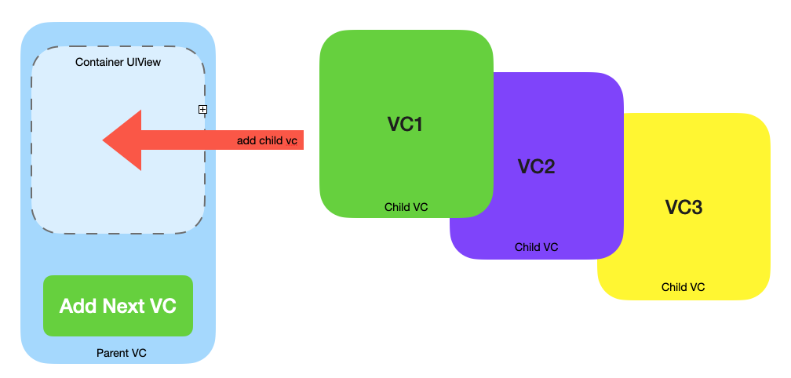
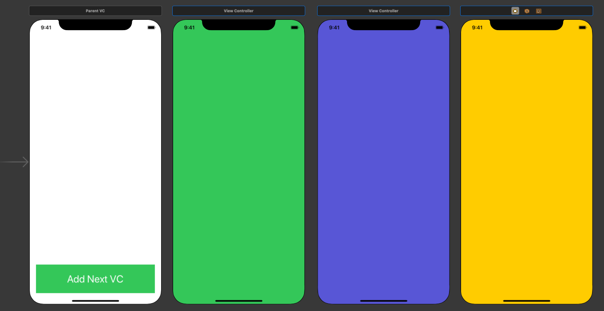
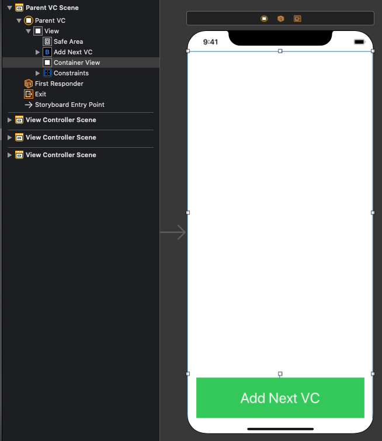
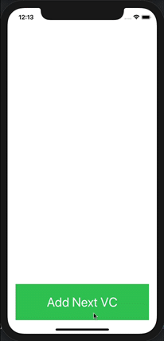

# ViewControllerContainment
Demo of Swift ViewController Containment

View controller containment enables one view controller to embed one or more other view controllers within itself. 
This technique is helpful when creating a complex UI using composition. 
Composition allows us to create several (“child”) view controllers separately and then combine them in one main 
(“parent”) view controller using view controller containment.

Our demo app looks like this:



We have a **Parent** view controller with a **UIView** (the “container view”) and a **UIButton**.
When the button's tapped it causes the “next” (in rotation) child view controller to be added to the parent.
When the child view controller is added its view (its UIView) is displayed in the Child VC container UIView.

In Interface Builder create a view controller that will be the parent, and three other **UIViewControllers** that will be child VCs.
Make sure to set the storyboard IDs of the child VCs to “vc1”, “vc2” and “vc3”.
Set the child view controller’s views to be distinct colors:



Add a UIView (this will be the “container view”) to the parent VC and create an outlet for it.
Add a UIButton to the parent VC and create an action for it:



In the parent view controller add:

``` swift
import UIKit

class ParentVC: UIViewController {

    @IBOutlet weak var containerView: UIView!
    
    let childVCIds = ["vc1", "vc2", "vc3"]
    var childVCs = [UIViewController]()
    var childVCIndex = 0
    var currentChildVC: UIViewController?
    
    override func viewDidLoad() {
        super.viewDidLoad()
        
        guard let storyboard = storyboard else { return }
        
        // Store refs to our child view controllers in an array
        childVCIds.forEach { childVCId in
            childVCs.append(storyboard.instantiateViewController(identifier: childVCId))
        }
    }
    
    @IBAction func addNextVC(_ sender: Any) {
        if let current = currentChildVC {
            // If we have a current child view controller remove it
            current.willMove(toParent: nil)
            current.view.removeFromSuperview()
            current.removeFromParent()
        }

        currentChildVC = childVCs[childVCIndex]  // Get the next child view controller
        
        addChild(currentChildVC!)  // Add the view controller as a child of this view controller
        currentChildVC!.view.frame = containerView.bounds  // Size the child view controller's view to fill the container view
        containerView.addSubview(currentChildVC!.view)  // Add the child view controller's view as a subview of the container view
        currentChildVC!.didMove(toParent: self)  // You must tell the child VC that it has been added as a child of a VC
        
        childVCIndex += 1
        if childVCIndex == childVCs.count { childVCIndex = 0 }
    }
}

```

Running the app produces:


